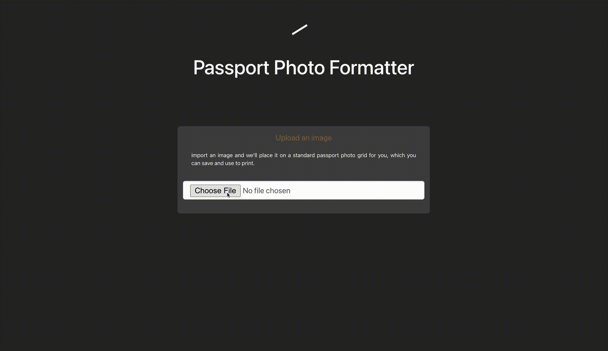

# Passport Image Placer

This project is part of the Passport Photo Formatter application. It hosts the UI of the site.

## Launching (React)

In the project root directory, run `npm start`

## Example Run (with Spring Boot application running) 

### front page

### uploaded

### result display

